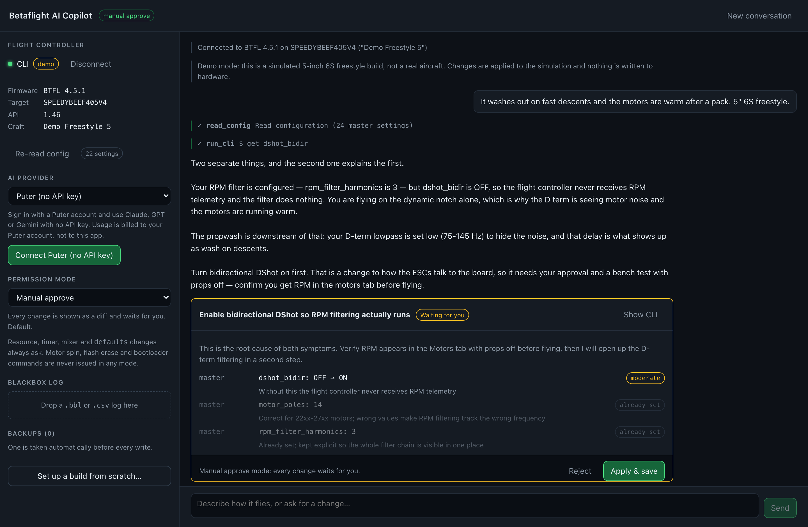
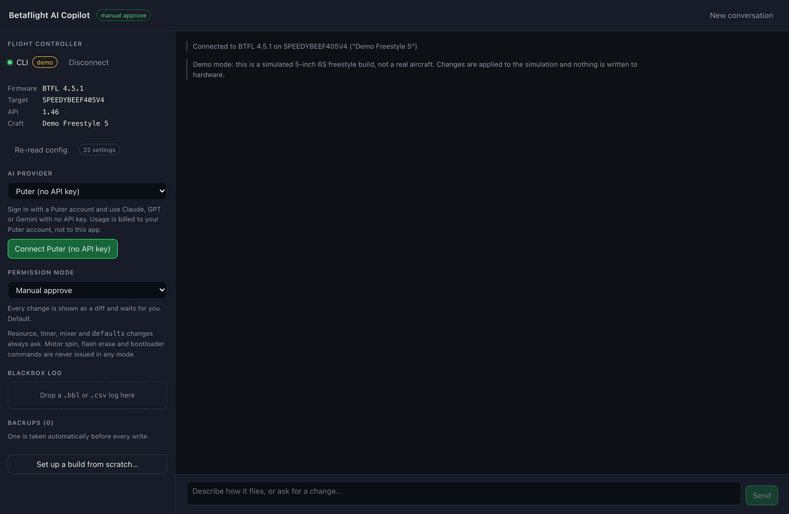
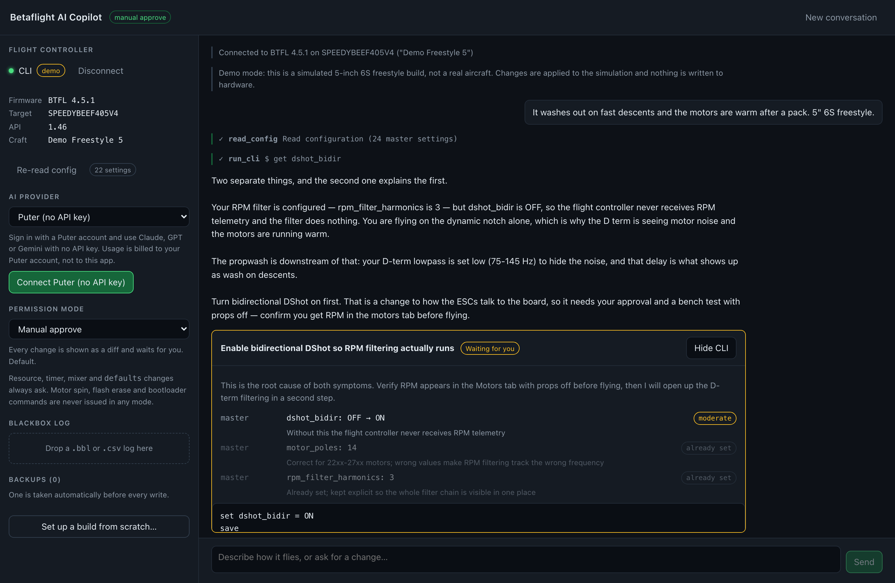

# Betaflight AI Copilot

An AI copilot that plugs into your quad. It connects to a Betaflight flight
controller over Web Serial, reads the real configuration off the board, and
tunes it by conversation — showing you a diff of every change before it writes
anything.




No installer, no backend, no API key required. It is a static progressive web
app: open the page, plug in the quad, start talking.

---

## Table of contents

- [Why a separate app and not a Configurator plugin](#why-a-separate-app-and-not-a-configurator-plugin)
- [Signing in to an AI without an API key](#signing-in-to-an-ai-without-an-api-key)
- [Safety model](#safety-model)
- [What it can do](#what-it-can-do)
- [Try it without a quad](#try-it-without-a-quad)
- [Getting started](#getting-started)
- [Run it locally with Docker](#run-it-locally-with-docker)
- [Deploying it](#deploying-it)
- [How it works](#how-it-works)
- [Blackbox support](#blackbox-support)
- [Development](#development)
- [Privacy](#privacy)
- [Disclaimer](#disclaimer)

---

## Why a separate app and not a Configurator plugin

The Web Serial API grants an **exclusive lock** on a serial port. Only one page
can hold the flight controller at a time. A browser extension injected into
`app.betaflight.com` could not open the port the Configurator already owns, and
there is no supported way for one page to lend its port to another.

So the copilot owns the port itself and speaks the flight controller's own
protocols directly:

- **MSP** for identification and live telemetry
- **the CLI** (`diff all`, `set x = y`, `save`) for reading and writing
  configuration — the same path the Configurator uses for backup and restore,
  and far more stable across firmware versions than packed MSP structs

**Close Betaflight Configurator before connecting here.** Both cannot hold the
board at once.

Requires a Chromium desktop browser: Chrome, Edge, Opera, Brave, Arc. Firefox
and Safari have not shipped Web Serial.

---

## Signing in to an AI without an API key

Four providers ship, selectable at runtime. Two of them need no API key at all.

| Provider | What the user does | Who pays | Tool calling |
|---|---|---|---|
| **Puter** | Signs in with a Puter account | The user's Puter account | Yes |
| **OpenRouter** | One click, OAuth PKCE redirect | The user's OpenRouter credit | Yes, 400+ models |
| **Your own key** | Pastes a key, or points at local Ollama | Whoever owns the key | Yes |
| **Chrome built-in** | Nothing — Gemini Nano runs on-device | Nobody, it is free and offline | No, advisory only |

### Puter — the zero-setup default

[Puter.js](https://developer.puter.com/) runs on a **user-pays** model: the
visitor authenticates with their own Puter account and their own usage is
billed to them. This project ships no key and runs no server. Claude, GPT and
Gemini are all reachable through it.

### OpenRouter — one click, no key to copy

OpenRouter implements OAuth with
[PKCE](https://openrouter.ai/docs/guides/overview/auth/oauth): the page
generates a code verifier, sends the user to `openrouter.ai/auth`, and exchanges
the returned code for a scoped API key — no client registration, no backend, no
secret in the bundle, and nothing for the user to copy and paste. The key is
stored in the browser and used directly from it.

### Chrome built-in — no account at all

If Chrome exposes the [Prompt API](https://developer.chrome.com/docs/ai/built-in),
Gemini Nano is used on-device: free, offline, private. It has no tool calling,
so the copilot drops to advisory mode — it explains and suggests exact CLI
lines, and says plainly that it cannot apply them.

### Your own key

Anthropic, OpenAI, Groq, OpenRouter, or any OpenAI-compatible endpoint
including a local `ollama serve`. The key is kept in this browser's local
storage and sent only to the endpoint you named.

---

## Safety model

This software writes to a device that spins sharp things. The permission model
is borrowed from Claude Code, and the guardrails below are enforced in code, not
in the prompt.

### Permission modes

| Mode | Applies automatically | Always asks |
|---|---|---|
| **Manual approve** (default) | nothing | everything |
| **Auto-apply tuning** | PID, filter, rate changes | hardware, receiver, power, modes |
| **Full auto** | tuning and setup changes | resource / timer / mixer / `defaults` |

### Risk tiers

Every proposed setting is classified before it is shown to you:

- **safe** — tuning knobs. Wrong values fly badly; they break nothing on the
  bench and the backup undoes them.
- **moderate** — motors, power, receiver, failsafe, GPS, OSD, VTX. Real
  consequences if wrong, but ordinary setup work.
- **dangerous** — `resource`, `timer`, `dma`, `mixer`, `board_name`,
  `defaults`. These change hardware mapping or wipe state, and **always**
  require explicit approval, in every mode.
- **blocked** — `motor`, `bl`, `dfu`, `msc`, `flash_erase`, `esc4way` and
  friends. Motor spin, flash erase and bootloader entry. **Never issued in any
  mode.** The tool layer refuses them and tells the model to propose something
  else.

An unrecognised setting name is classified **moderate**, never safe — a setting
the app does not know is exactly the one not to auto-apply.

### The other guarantees

- **Never writes to an armed aircraft.** Arming flags are checked before every
  change set, regardless of mode.
- **Automatic backup before every write.** A full `diff all` snapshot is taken
  and stored before any change reaches the board, restorable with one click.
- **Nothing is written except through a change set.** The model's `run_cli`
  tool accepts read-only commands only; a write attempt there is refused with
  an explanation.
- **You see the exact CLI.** "Show CLI" on any change set prints the literal
  command sequence, including the profile switches and the closing `save`.
- **Batches stop at the first rejection.** If the firmware rejects a command,
  the remaining commands are not sent and nothing is saved.

**Take your props off** before applying anything.

---

## What it can do

- **Read your build.** Board, target, firmware, features, every non-default
  setting across master, all PID profiles and all rate profiles.
- **Diagnose from symptoms.** Describe how it flies and it reasons about your
  actual numbers, not generic advice.
- **Propose and apply changes** as reviewable diffs, saved to EEPROM with an
  automatic reconnect after the reboot.
- **Analyse blackbox logs.** Gyro noise spectrum with peak frequencies, PID
  error statistics, motor saturation and imbalance — see the limits below.
- **Set up a build from scratch.** The wizard collects what the board cannot
  report (motor kv, prop size, what the quad is for) and works through receiver
  and failsafe, then power, then filtering, then PIDs, then rates, one
  approvable stage at a time.
- **Back up and restore.** Every write is preceded by a snapshot; snapshots can
  be downloaded as ordinary Betaflight CLI dumps.
- **Live telemetry.** Voltage, current, mAh, RSSI, gyro loop time, I2C errors.
- **Run without hardware.** A built-in simulated flight controller, for trying it
  out or for development.

---

## Try it without a quad

Click **Try the demo — no hardware needed** in the sidebar. It connects to a
simulated flight controller built into the app: an ordinary 5-inch 6S freestyle
build, with a few deliberately imperfect settings for the copilot to find.

The simulator speaks real MSP framing and real CLI grammar behind a Web
Serial-shaped port, so every layer above it runs exactly as it does against
hardware — the same parser, the same risk classification, the same approval
gate, the same reboot-and-reconnect after a save. Only the wire is fake.

It is also how the screenshots in this README are produced (`npm run
screenshots`), which is why they show real output rather than a mockup.

| | |
|---|---|
|  |  |
| Connected, configuration read | "Show CLI" — note that the two values already set are excluded from the write |

---

## Getting started

```bash
git clone https://github.com/deviverr/Betaflight-AI-Copilot.git
cd Betaflight-AI-Copilot
npm install
npm run dev
```

Then, in a Chromium browser:

1. Close Betaflight Configurator if it is open.
2. Plug the flight controller in over USB. **Props off.**
3. Click **Connect** and pick the port.
4. Pick an AI provider in the sidebar and sign in.
5. Describe how the quad flies.

---

## Run it locally with Docker

The repository ships a two-stage image: Node builds the bundle, nginx serves it.
Nothing else runs — there is no backend to host.

```bash
docker compose up -d          # http://localhost:8080
docker compose logs -f        # follow
docker compose down           # stop
```

Change the port with `COPILOT_PORT=3000 docker compose up -d`.

`http://localhost` is a secure context as far as browsers are concerned, so Web
Serial works over plain HTTP there — no certificate needed for normal local use.

### Reaching it from another machine

Plain HTTP on a LAN address is *not* a secure context, so Web Serial is
unavailable and the Connect button will not work. Turn on the optional HTTPS
listener, which generates a self-signed certificate on first start:

```bash
COPILOT_TLS=on COPILOT_TLS_HOST=workshop.local docker compose up -d
# https://workshop.local:8443
```

The browser will warn about the certificate once; accept the exception and Web
Serial works. The certificate lives in a named volume, so restarting the
container does not invalidate the exception you granted.

One honest caveat: Chromium refuses to register a service worker behind an
untrusted certificate. Over self-signed HTTPS the app runs and Web Serial works,
but PWA install and offline loading do not until the certificate is actually
trusted by the machine. Over `http://localhost` everything works, service
worker included.

### Without compose

```bash
docker build -t betaflight-ai-copilot .
docker run -d -p 8080:80 --name copilot betaflight-ai-copilot
```

### Without Docker

`npm run build` produces `dist/`, which any static server will host:

```bash
npm run build
npx serve dist          # or: python3 -m http.server -d dist 8080
```

---

## Deploying it

The build output is a static directory — host it anywhere.

```bash
npm run build      # -> dist/
```

Web Serial requires a secure context, so serve over HTTPS (or `localhost`).

- **GitHub Pages** — `.github/workflows/pages.yml` deploys `main` automatically.
  Enable Pages with source "GitHub Actions" in the repository settings.
- **Netlify / Vercel / Cloudflare Pages** — build `npm run build`, publish
  `dist`.
- **Any static host** — `vite.config.ts` sets `base: "./"`, so the app works
  from a subdirectory without configuration.
- **Self-hosted** — see [Run it locally with Docker](#run-it-locally-with-docker).
- **Installable** — it ships a web app manifest and a service worker, so
  browsers offer to install it, and the shell loads offline.

---

## How it works

```
  Browser tab
  ┌─────────────────────────────────────────────────────────────┐
  │  Vue 3 UI                                                    │
  │    transcript · change-set diffs · approval buttons           │
  ├─────────────────────────────────────────────────────────────┤
  │  Agent loop                 src/ai/agent.ts                  │
  │    stream · run tools · feed results back · repeat            │
  ├──────────────────────────┬──────────────────────────────────┤
  │  Providers               │  Tools        src/ai/tools.ts     │
  │    Puter                 │    read_config                    │
  │    OpenRouter (PKCE)     │    run_cli        (read-only)     │
  │    Your own key          │    propose_changes ── the only    │
  │    Chrome Gemini Nano    │    read_telemetry     write path  │
  │                          │    analyze_blackbox               │
  │                          │    save_backup                    │
  ├──────────────────────────┴──────────────────────────────────┤
  │  Permission gate      src/core/permissions.ts                │
  │    risk tiers · mode rules · armed check · auto backup        │
  ├─────────────────────────────────────────────────────────────┤
  │  Config model         src/core/config.ts, changeset.ts       │
  │    parse `diff all` · scope tracking · emit CLI commands      │
  ├─────────────────────────────────────────────────────────────┤
  │  Link                 src/msp/                               │
  │    MSP v1/v2 codec · CLI channel · Web Serial transport       │
  └─────────────────────────────────────────────────────────────┘
                              │ USB
                    ┌─────────▼─────────┐
                    │ Flight controller │
                    └───────────────────┘
```

Layout:

| Path | What lives there |
|---|---|
| `src/msp/` | MSP v1/v2 framing, Web Serial transport, CLI channel |
| `src/msp/simulator.ts` | the simulated flight controller behind the demo |
| `src/core/config.ts` | `diff all` parser with master / profile / rateprofile scoping |
| `src/core/changeset.ts` | risk classification and CLI command generation |
| `src/core/permissions.ts` | permission modes and the decision rules |
| `src/core/backup.ts` | snapshots and restore |
| `src/core/store.ts` | application state and the approval queue |
| `src/ai/providers/` | the four AI providers behind one interface |
| `src/ai/agent.ts` | the tool-calling loop |
| `src/ai/prompts.ts` | system prompt and the Betaflight reference the model reads |
| `src/blackbox/` | `.bbl` decoder, CSV reader, FFT and statistics |
| `src/components/` | Vue components |
| `docker/` | nginx config and the optional self-signed TLS entrypoint |

---

## Blackbox support

Two input paths, both fully supported:

- **`.bbl` / `.bfl` binary** — parsed directly in the browser. The decoder
  implements every encoding Betaflight emits for main frames: `SIGNED_VB`,
  `UNSIGNED_VB`, `NEG_14BIT`, `TAG8_8SVB`, `TAG2_3S32`, `TAG8_4S16`,
  `TAG2_3SVARIABLE` and `NULL`, with the twelve predictors main frames use
  (GPS frames are skipped rather than decoded).
- **CSV** — as exported by `blackbox_decode` or Betaflight Blackbox Explorer.

The bit layouts follow `blackboxWriteTag2_3S32`, `blackboxWriteTag8_4S16` and
`blackboxWriteTag2_3SVariable` in Betaflight's
`src/main/blackbox/blackbox_encoding.c`. Rather than trust that reading, the
test suite ports those three encoders to TypeScript and round-trips every
layout boundary and several thousand random values through them
(`tests/blackbox-roundtrip.test.ts`). An encoding outside that set is refused
rather than guessed at, and the app falls back to header-only analysis.

### One thing worth knowing about your logs

The round-trip tests turned up a defect in Betaflight's own encoder, not in
this decoder. `blackboxWriteTag2_3SVariable` escapes to its wide layout at
`|field0| >= 256` and `|field1|, |field2| >= 128`, but its 877 layout only
gives field 0 eight signed bits and fields 1 and 2 seven signed bits. Values
between those thresholds are truncated **when the log is written, on the
flight controller** — 100 is stored and read back as −28.

Nothing a reader can do recovers a value the writer discarded, so this decoder
reproduces exactly what was written, and the affected band is documented in a
test so it stays visible. In practice it affects a narrow range of gyro deltas
and does not change the shape of a noise spectrum.

---

## Development

```bash
npm run dev         # dev server with hot reload
npm test            # 123 tests
npm run test:watch
npm run typecheck   # vue-tsc, strict
npm run build
npm run screenshots # regenerate docs/screenshots from the running dev server
```

The test suite covers the parts where being wrong is expensive:

| Suite | Covers |
|---|---|
| `tests/codec.test.ts` | MSP v1/v2 framing, both checksums, split chunks, bad CRC, error frames |
| `tests/link.test.ts` | a fake flight controller: identity handshake, telemetry, CLI mode, batch abort on rejection |
| `tests/config.test.ts` | `diff all` parsing, profile scoping, lookups |
| `tests/changeset.test.ts` | risk classification, CLI generation and profile-switch ordering, no-op elision |
| `tests/permissions.test.ts` | every mode against every risk tier |
| `tests/agent.test.ts` | the tool loop, tool-result feedback, iteration cap, write refusals |
| `tests/blackbox.test.ts` | header parsing, frame decoding with predictors, FFT, peak finding, CSV statistics |
| `tests/blackbox-roundtrip.test.ts` | every tag encoding round-tripped against a port of Betaflight's own encoder |
| `tests/simulator.test.ts` | the demo board driven through the real link: handshake, diff, `set`, batch abort, save |
| `tests/ui.test.ts` | component rendering, approval buttons, wizard output |

There is no hardware in CI, so `tests/link.test.ts` and `tests/simulator.test.ts`
drive the real `FcLink` against flight controllers implemented behind a Web
Serial-shaped port — real framing, real CLI completion detection, real error
paths. Two bugs in this repository were found that way: an infinite loop in the
serial read pump when a device closes its stream, and a CLI error pattern that
did not match Betaflight's `###ERROR:###` format.

---

## Privacy

- The app has no backend. Nothing is sent anywhere except to the AI provider
  you picked.
- Your configuration text, and the blackbox statistics you ask about, are sent
  to that provider as part of the conversation — that is how the copilot works.
  A Betaflight config contains no personal data, but it does describe your
  aircraft.
- With **Chrome built-in**, nothing leaves the machine at all.
- API keys, backups and settings live in this browser's local storage only.

---

## Disclaimer

This project is **not affiliated with the Betaflight project**.

Multirotors are dangerous. This tool can change how yours flies. Review every
change before approving it, keep the props off while configuring, and test any
new tune carefully in a safe place. Restore a backup if something feels wrong.
You are responsible for your aircraft.

Licensed under the [MIT License](LICENSE).
